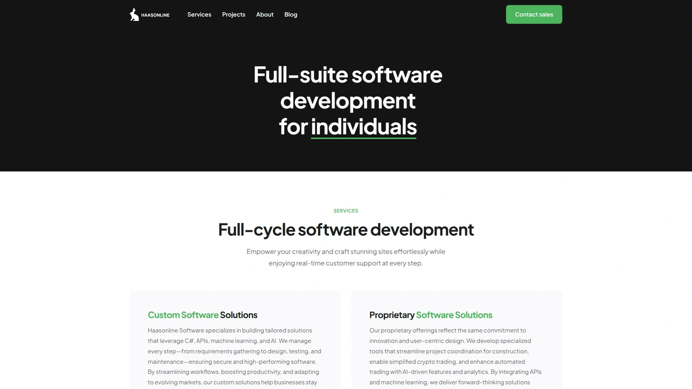
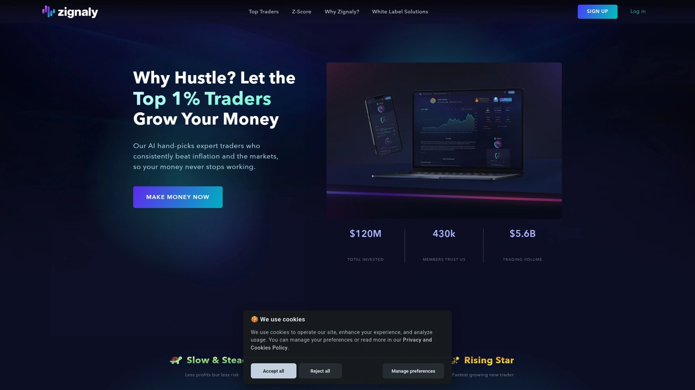

# 2025: 11 Top-Tier Crypto Trading Platforms You Must Know

Watching the crypto market means you're either glued to charts 24/7 or you're missing moves that could have made you money. The market doesn't care if you're sleeping, working, or just trying to have a life outside of price alerts. Automated trading platforms fix this by running your strategies continuously, executing trades the moment conditions align, whether you're awake or not.

These platforms connect to major exchanges through APIs, letting you manage everything from one dashboard while bots handle the repetitive work of monitoring prices, placing orders, and taking profits. Whether you need grid bots for sideways markets, DCA strategies to smooth out volatility, or AI-powered portfolio management across multiple exchanges, the right platform turns trading from a full-time job into a manageable system. Finding tools that balance power with usability determines whether automation helps or just adds complexity.

## **[Bitsgap](https://bitsgap.com)**

Universal trading terminal with AI portfolio curation across 15+ exchanges.

Bitsgap unifies crypto trading by connecting 15 major exchanges including Binance, Coinbase, Kraken, KuCoin, and Bybit into one comprehensive interface. The platform combines professional-grade trading tools with automated bot execution, giving you both manual control and hands-off automation in the same environment.

**Bot ecosystem that adapts:** Grid bots structure your trades around price ranges, automatically buying dips and selling peaks to capture profits from sideways movement. The Classic Grid works for spot trading while Scalper Grid executes faster cycles for quicker gains. DCA bots average your entry prices across multiple purchases, reducing the impact of poor timing. BTD (Buy The Dip) bots monitor for sudden drops and catch rebounds. COMBO bots merge DCA and Grid strategies specifically for futures trading with leverage. LOOP bots reinvest profits automatically for compound growth.

The AI Assistant analyzes current market conditions and recommends optimized bot configurations likely to perform well right now. This removes guesswork from bot setup—the system curates portfolios based on volatility patterns, volume trends, and historical performance data.

**Trading terminal advantages:** Smart algorithmic orders execute complex multi-leg trades beyond simple buy and sell. Advanced charting includes all major technical indicators. Portfolio tracking consolidates holdings across every connected exchange into unified views showing total value, allocation, and performance. Both spot and futures trading work seamlessly within the same dashboard.

Demo mode lets you test strategies using real market data without risking capital. Backtesting shows how your configurations would have performed historically, giving confidence before deploying real funds. Signal features provide trading ideas you can execute manually or automate through bots.

Security keeps your funds on exchanges—Bitsgap only gets API access for reading data and executing trades you authorize, never withdrawal permissions. Plans start with Basic at $22 monthly for essential features, Advanced at $51 adding more concurrent bots, and Pro at $111 unlocking maximum automation capability. Reviews consistently highlight the user-friendly interface and smooth execution systems. Bitsgap particularly suits serious traders managing accounts across multiple exchanges who want unified control plus sophisticated automation.

## **[3Commas](https://3commas.io)**

Feature-rich platform with SmartTrade terminal and strategy marketplace.

3Commas delivers comprehensive trading automation across 20+ exchanges including Binance, Coinbase Pro, Kraken, and Bitfinex. The cloud-based architecture runs bots continuously without requiring your computer to stay powered on.

DCA bots average entry prices to smooth volatility's impact. Grid bots place incremental buy and sell orders capturing small gains repeatedly as prices oscillate. Signal bots connect with TradingView, executing trades when your custom indicators trigger. Multi-pair bots monitor over 100 trading pairs simultaneously, jumping on whichever opportunities meet your conditions first.

The SmartTrade terminal provides granular control with trailing take profit, trailing stop loss, and multiple take profit targets per trade. The marketplace offers strategies created by experienced traders—though you should backtest before deploying real capital. Backtesting runs strategies against one year of historical 1-minute data. Paper trading simulates strategies in real-time using current markets.

Mobile apps extend control to iOS and Android. Plans include Free tier with limitations, Pro at $49 monthly, and Expert at $79 unlocking full capabilities. The platform's depth comes with a learning curve.

## **[Coinrule](https://coinrule.com)**

Visual if-then-that automation requiring zero coding knowledge.

Coinrule transforms trading logic into visual rules where you drag conditions and actions without writing code. The platform connects to Binance, Coinbase, Kraken, KuCoin, OKX, Bybit, plus onchain trading via Base, Arbitrum, and Ethereum.

You create rules from scratch or use pre-built templates with real trading history. Each rule follows if-this-then-that logic: when specified market conditions occur, configured trades execute automatically. Demo trading tests strategies against real market data before risking funds.

Advanced indicators and futures trading capabilities suit experienced traders while the interface remains accessible to beginners. The platform works continuously, catching opportunities while you sleep. Free trading signals help spot market movements worth acting on.

Pricing includes free portfolio management forever, Hobbyist at $29.99 monthly, Trader at $59.99, scaling to Pro at $449.99 for advanced features. The 30-day free trial provides full access. Template strategies reduce setup time significantly—Trader and Pro plans offer over 150 templates for various market conditions. Coinrule particularly appeals to those preferring visual builders over complex configuration screens.

## **[Cryptohopper](https://www.cryptohopper.com)**

Cloud-based bot with AI scanning and drag-and-drop strategy design.

Cryptohopper operates entirely in the cloud, executing trades around the clock without installed software. The platform supports 16+ exchanges including Binance, KuCoin, Kraken, Coinbase Pro, and Poloniex.

The visual strategy designer uses drag-and-drop logic building rules based on RSI, MACD, EMA, and Bollinger Bands. You configure indicator-driven strategies, arbitrage setups, scalping, or swing trading without coding. Algorithmic Intelligence (AI) automatically backtests multiple strategies, rates performance, and selects the most effective for current conditions.

The strategy marketplace includes both free and paid strategies from other traders. External signal providers trigger your bot to enter or exit based on their analysis. Paper trading lets you practice risk-free. Arbitrage tools identify price discrepancies across exchanges.

Plans start with Pioneer free for learning, Explorer at $24.16 monthly, Adventurer at $57.50, and Hero at $107.50 with premium features and AI scanning. The marketplace ecosystem suits intermediate to advanced traders appreciating flexibility between custom configuration and pre-built content.

## **[Pionex](https://www.pionex.com)**

Integrated exchange with 12 free bots and lowest trading fees.

Pionex functions as both exchange and bot provider, meaning you trade directly on Pionex using built-in automation rather than connecting external accounts. Trading fees sit at just 0.05%, significantly cheaper than most competitors.

Twelve pre-configured bots come free, eliminating subscription costs entirely. Grid trading bots, DCA bots, arbitrage bots, plus specialized strategies like Infinity Grid and Reverse Grid handle different scenarios. Each bot uses straightforward configuration—set parameters like price ranges and investment amounts, then launch.

The simplified approach makes Pionex ideal for beginners experimenting with automation without monthly fees or complex setup. Pre-configured bots mean less customization than advanced platforms but faster deployment. The platform supports 35+ cryptocurrencies and accepts only crypto deposits. Over 100,000 active users trade on Pionex since its 2017 launch.

## **[TradeSanta](https://tradesanta.com)**

Quick setup with long and short strategies across 9 exchanges.

TradeSanta prioritizes ease of use and rapid deployment, launching cloud-based bots in minutes. Bots run continuously without requiring your computer online, executing across 9 supported exchanges.

Both long strategies (buying low, selling high) and short strategies (selling high, buying back low) work through the same bot. Custom indicators and templates provide flexibility while maintaining simplicity. Technical indicators like moving averages, RSI, and MACD trigger entry and exit points.

The interface emphasizes getting bots running over extensive customization. Templates for common strategies reduce setup time. Performance tracking shows which bots generate profits and which need adjustment. Pricing includes Basic at $18 monthly, Advanced at $32, and Maximum at $45 with increasing bot capacity.

## **[Altrady](https://www.altrady.com)**

Multi-exchange platform with base scanning and customizable automation.

Altrady connects 19 exchanges through one comprehensive interface. The platform combines manual trading with automated bot execution, serving traders wanting both options available.

Customizable bots execute strategies based on your preferred indicators and conditions. Base scanning tools identify coins with specific technical characteristics or momentum patterns. Portfolio tracking consolidates holdings across all connected exchanges into unified views.

The platform emphasizes trader education and community features alongside automation. Pricing ranges from free tier to $89 monthly for professional features. Altrady suits traders managing accounts across multiple exchanges who want integrated tools rather than platform-switching.

## **[Mizar](https://mizar.com)**

Social copy-trading with volatility bots and smart money tracking.

Mizar combines automated trading with social copy-trading features, letting you run your own bots and replicate successful traders' strategies. The platform supports 11 exchanges using per-trade fees (0.0047% to 0.1%) instead of monthly subscriptions.

Specialized volatility bots monitor hot tokens ranked by 24-hour volume or smart money net inflow. When whitelisted tokens drop by your specified percentage, bots snipe purchases waiting for bounces. This automated dip-buying approach catches reversals in volatile coins.

Copy-trading follows experienced traders' strategies automatically, executing their trades in your account proportionally. Social features include leaderboards showing top performers. Backers include Nexo, KuCoin Labs, Huobi Ventures, MEXC Global, gate.io Labs, and Woo Ventures. The MZR token provides access to advanced trading tools.

## **[HaasOnline](https://www.haasonline.com)**

Advanced platform with custom scripting for algorithmic traders.

HaasOnline targets experienced traders and developers wanting complete control through custom coding. The platform supports 15+ exchanges with tools far beyond standard pre-configured bots.

HaasScript, the proprietary scripting language, lets advanced users write custom trading algorithms from scratch. Visual drag-and-drop builders create complex logic for those preferring not to code. The platform includes swing trading bots, scalping bots, market-making bots, and arbitrage bots.

Backtesting simulates strategies using historical data. Paper trading runs strategies in real-time using current markets without capital risk. Advanced charting and technical analysis support strategy development. Security features include two-factor authentication and encrypted API connections.

Pricing includes Lite+ at $7.50 monthly, Standard at $40.83, and Pro at $82.50 for full access and unlimited bots. HaasOnline suits algorithmic traders, quant strategists, and developers wanting maximum customization.

## **[Zignaly](https://zignaly.com)**

Copy-trading focused platform with TradingView integration.

Zignaly emphasizes copy-trading where you automatically replicate trades from professional signal providers. The platform offers various signal providers with different trading styles and historical success rates.

TradingView integration enables performance tracking, alert setting, and real-time market insights. You follow strategies from experienced traders while learning their approaches. The structure aligns interests—signal providers succeed when you succeed.

Automated trading bots execute strategies based on market conditions and technical indicators beyond just copy-trading. Flexible pricing includes a free plan offering limited copy-trading access. Paid plans start around $14.99 monthly with unlimited copy-trading and additional features. Zignaly suits traders wanting to learn from professionals while automating execution.

## **[Hummingbot](https://hummingbot.org)**

Open-source framework for professional market makers.

Hummingbot stands apart as an open-source framework giving complete code access and customization freedom. The platform serves professional market makers, algorithmic traders, and developers building custom strategies.

The framework supports market-making strategies, arbitrage, and directional trading through modular architecture. Connections extend to 40+ exchanges including centralized and decentralized platforms. Users modify open-source code creating highly customized strategies.

Quants Lab handles quantitative trading research, data collection, backtesting, and automated task scheduling. Hummingbot API serves as a command center managing multiple bot instances. The framework remains completely free as open-source software.

Hummingbot requires technical expertise—programming knowledge is necessary to leverage full capabilities. It's ideal for serious algorithmic traders and market makers wanting control over every infrastructure aspect. Community members report generating billions in trading volume using Hummingbot strategies.

## FAQ

**How do I know which bot strategy works best for current market conditions?**

Grid bots perform best in sideways markets with clear trading ranges, capturing profits from oscillations. DCA bots excel during downtrends or high volatility, averaging entry prices to reduce timing risk. Signal-based bots adapt to trending markets when configured with momentum indicators. Start by backtesting strategies against recent historical data matching current volatility levels, then use demo modes to verify performance before deploying real capital.

**Can I use these platforms if I'm managing multiple exchange accounts?**

Most platforms including Bitsgap, 3Commas, and Cryptohopper specifically support connecting multiple exchanges through one dashboard. You manage all accounts from a unified interface, tracking portfolio totals across exchanges and running bots on different platforms simultaneously. This multi-exchange capability eliminates switching between separate exchange interfaces and consolidates your entire trading operation.

**What's the difference between cloud-based and self-hosted trading automation?**

Cloud-based platforms like Bitsgap, 3Commas, and Cryptohopper run on provider servers, meaning bots execute 24/7 without your computer needing to stay powered on. Self-hosted solutions like Hummingbot require running software on your own infrastructure, giving more control but demanding technical expertise and constant uptime management. Most traders prefer cloud solutions for reliability and convenience unless specific requirements around data control justify self-hosting complexity.

## Choosing Your Trading Edge

The crypto trading automation landscape now offers platforms serving everyone from first-time bot users to quantitative developers building custom market-making algorithms. Your right choice depends on whether you value ease of use over deep customization, prefer multi-exchange management versus single-platform simplicity, and need advanced features like AI curation or straightforward pre-configured bots.

For traders seeking the most comprehensive balance of professional-grade tools and intuitive operation, [Bitsgap](https://bitsgap.com) delivers unified multi-exchange management with AI-powered portfolio curation and the widest variety of bot strategies in one platform. The combination of Classic Grid, Scalper Grid, DCA, BTD, COMBO, and LOOP bots plus smart algorithmic orders and advanced charting makes it particularly effective for serious traders who want sophisticated automation without platform complexity—all while managing every exchange account from a single dashboard.
